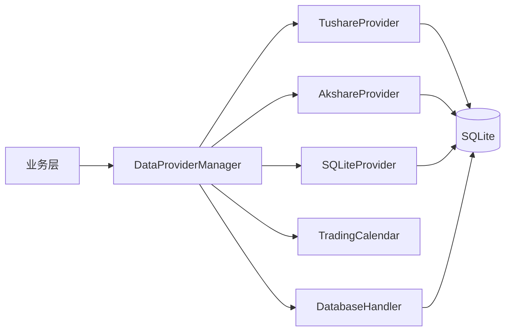
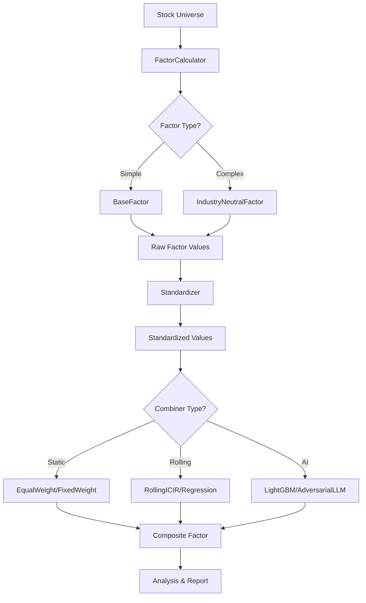
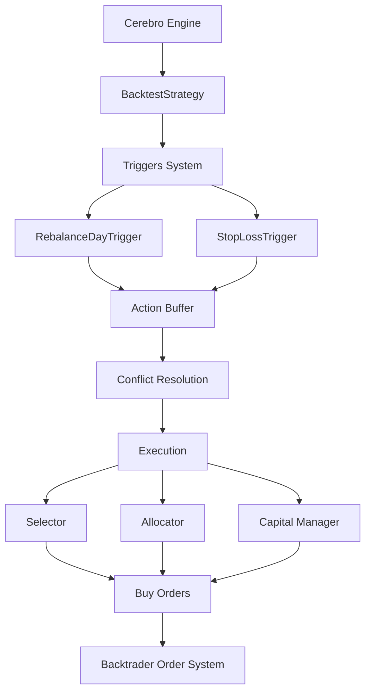
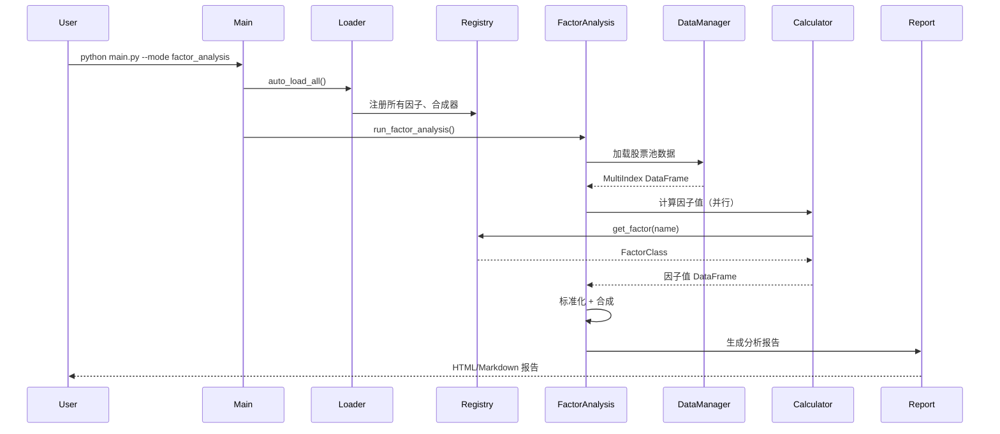
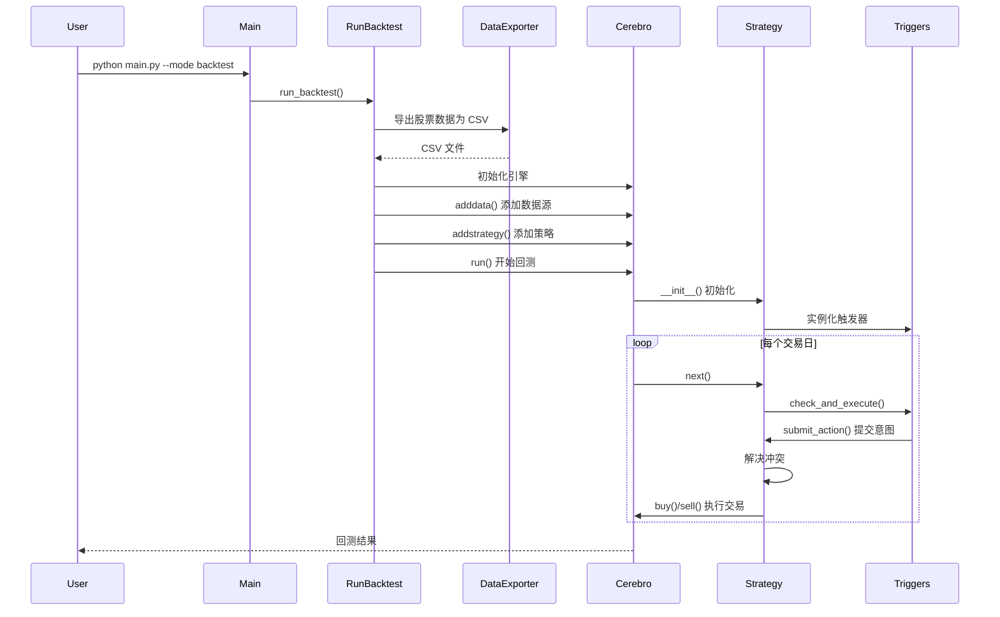

# 量化交易系统 - 技术架构分析报告

> 项目名称：Quant Project  
> 分析时间：2025-12-27  
> 项目状态：极早期开发阶段（实验性）

---

## 📋 执行摘要

这是一个基于 Python 的**量化交易研究平台**，采用**模块化、可插拔的架构设计**，支持因子研究、策略回测和投资组合分析。系统的核心特点是通过**装饰器注册系统**实现组件的自动发现与加载，以及通过 **YAML 配置文件**实现灵活的参数化管理。

### 核心能力

- **多数据源支持**：Tushare、Akshare、本地 SQLite 数据库
- **因子系统**：20+ 预定义因子，支持行业中性处理和 AI 合成
- **回测引擎**：基于 Backtrader 的事件驱动回测框架
- **配置驱动**：分层 YAML 配置，支持环境变量替换
- **可扩展性**：装饰器自动注册，易于添加新组件

---

## 🏗️ 整体架构

### 架构分层

系统采用经典的**分层架构**模式，自下而上分为以下层次：

```
┌─────────────────────────────────────────────────────────────┐
│                     应用层 (Application)                    │
│         main.py + scripts/ (下载、回测、因子分析)            │
├─────────────────────────────────────────────────────────────┤
│                      业务层 (Business)                       │
│  ┌──────────────┐  ┌──────────────┐  ┌──────────────┐      │
│  │ factors/     │  │ backtest/    │  │  scripts/    │      │
│  │ 因子计算引擎  │  │ 回测引擎      │  │  业务脚本    │      │
│  └──────────────┘  └──────────────┘  └──────────────┘      │
├─────────────────────────────────────────────────────────────┤
│                    数据访问层 (Data)                         │
│  ┌──────────────┐  ┌──────────────┐  ┌──────────────┐      │
│  │ data/manager │  │ providers/   │  │  calendar/   │      │
│  │ 数据管理器    │  │ 数据提供者    │  │  交易日历    │      │
│  └──────────────┘  └──────────────┘  └──────────────┘      │
├─────────────────────────────────────────────────────────────┤
│                    核心框架层 (Core)                         │
│  ┌──────────────┐  ┌──────────────┐  ┌──────────────┐      │
│  │ registry     │  │  loader      │  │   config     │      │
│  │ 组件注册表    │  │  模块加载器   │  │  配置管理     │      │
│  └──────────────┘  └──────────────┘  └──────────────┘      │
├─────────────────────────────────────────────────────────────┤
│                   基础设施层 (Infrastructure)                │
│         SQLite、日志系统、配置文件、数据文件                  │
└─────────────────────────────────────────────────────────────┘
```

### 架构特点

1. **插件化设计**：通过注册表 + 装饰器实现组件的热插拔
2. **配置驱动**：所有参数通过 YAML 配置文件管理
3. **模块解耦**：各层职责清晰，依赖关系单向（上层依赖下层）
4. **可扩展性**：新增组件只需添加文件并使用装饰器注册

---

## 🔧 核心框架层

### 1. 组件注册表 (registry.py)

**职责**：管理所有可插拔组件的注册与查询

**设计模式**：单例模式 (Singleton Pattern)

**支持的组件类别**：

| 类别 | 说明 | 注册装饰器 |
|------|------|-----------|
| `factors` | 因子库 | [`@register_factor`](../core/registry.py:188) |
| `combiners` | 因子合成器 | [`@register_combiner`](../core/registry.py:203) |
| `standardizers` | 标准化器 | [`@register_standardizer`](../core/registry.py:213) |
| `rolling_calculators` | 滚动计算器 | [`@register_rolling_calculator`](../core/registry.py:219) |
| `selectors` | 选股器 | [`@register_selector`](../core/registry.py:227) |
| `allocators` | 权重分配器 | [`@register_allocator`](../core/registry.py:236) |
| `capital_managers` | 资金管理器 | [`@register_capital_manager`](../core/registry.py:243) |
| `triggers` | 触发器 | [`@register_trigger`](../core/registry.py:251) |

**核心机制**：

```python
# 1. 装饰器注册
@register_factor('Momentum', category='simple')
class MomentumFactor(BaseFactor):
    def calculate(self, df):
        return df['close'].pct_change(periods=20)

# 2. 获取组件
factor_cls = get_factor('Momentum')
factor = factor_cls(params={})
```

**优点**：

- ✅ **自动发现**：只需添加文件，无需手动注册
- ✅ **类型安全**：集中管理，避免命名冲突
- ✅ **易于测试**：可以清空、注销、替换组件

---

### 2. 模块加载器 (loader.py)

**职责**：动态加载项目中的所有模块，触发装饰器注册

**加载策略**：

```python
components = {
    'factors': {
        'library': 'factors/library',
        'library.industry_neutral': 'factors/library/industry_neutral',
        'pipeline.combiners': 'factors/pipeline/combiners',
        'pipeline.standardizers': 'factors/pipeline/standardizers',
    },
    'backtest': {
        'pipeline.selectors': 'backtest/pipeline/selectors',
        'pipeline.allocators': 'backtest/pipeline/allocators',
        'pipeline.capital': 'backtest/pipeline/capital',
        'triggers': 'backtest/triggers',
    }
}
```

**初始化流程**：

1. [`main.py`](../main.py:42) 调用 [`auto_load_all()`](../core/loader.py:152)
2. 遍历所有组件目录，加载 Python 文件
3. 执行模块时，装饰器自动触发注册
4. 打印注册统计信息

---

### 3. 配置管理器 (config.py)

**职责**：从 YAML 文件加载配置，支持分层结构

**配置结构**：

```
configs/
├── data/               # 数据配置
│   ├── config.yaml     # 主配置
│   ├── calendar.yaml   # 交易日历
│   └── providers/      # 数据源配置
├── factors/            # 因子配置
│   ├── config.yaml     # 主配置
│   ├── library/        # 因子库
│   └── pipeline/       # 处理流水线
├── backtest/           # 回测配置
│   ├── config.yaml     # 主配置（包含broker交易费率配置）
│   ├── pipeline/       # 回测流水线
│   └── triggers/       # 触发器
├── universe.yaml       # 股票池
└── logging.yaml        # 日志配置
```

**核心特性**：

- ✅ **环境变量替换**：支持 `${VAR_NAME}` 语法
- ✅ **继承机制**：日期等参数支持从 `data` 向 `factors`、`backtest` 继承
- ✅ **向后兼容**：自动检测新旧配置结构
- ✅ **数据类封装**：使用 [`@dataclass`](../core/config.py:42) 提供类型安全

**配置加载方式**：

```python
config_loader = ConfigLoader('configs')
backtest_config = config_loader.load_backtest()
factors_config = config_loader.load_factors()
```

---

## 💾 数据访问层

### 架构图



### 1. 数据管理器 (data/manager.py)

**职责**：统一的数据访问接口，协调多数据源

**核心能力**：

| 功能 | 方法 | 说明 |
|------|------|------|
| 单股查询 | [`get_dataframe(symbol)`](../data/manager.py:224) | 获取单只股票日线数据 |
| 批量查询 | [`get_all_data_for_universe()`](../data/manager.py:269) | 批量获取合并数据，返回 MultiIndex |
| 数据下载 | [`prepare_data_for_universe()`](../data/manager.py:499) | 多线程下载缺失数据 |
| 收益率计算 | [`calculate_universe_forward_returns()`](../data/manager.py:462) | 计算未来收益率 |
| 行业映射 | [`get_industry_mapping()`](../data/manager.py:484) | 获取股票行业分类 |

**数据优先级**：

```python
provider_priority = ['sqlite', 'tushare', 'akshare']
# 优先使用本地数据库，失败时依次尝试远程数据源
```

**列名映射**：

系统使用统一的列名（如 `industry`, `close`, `volume`），内部通过 `COLUMN_MAPPING` 映射到不同数据库的真实列名：

```python
COLUMN_MAPPING = {
    'industry': ('stock_kind', 'Nnindnme'),
    'close': ('stock_daily_prices', 'close'),
    'total_revenue': ('stock_ProfitSheet', 'B001100000'),
    # ...
}
```

**性能优化**：

1. **批量查询**：使用 SQL `IN` 子句减少数据库访问次数
2. **预加载缓存**：全量读取基本面数据表，按股票分组缓存
3. **前向填充**：自动填充缺失的基本面数据
4. **多线程下载**：可配置 checker/downloader 线程数

---

### 2. 数据提供者 (data/providers/)

**抽象接口**：

```python
class BaseDataProvider(ABC):
    @abstractmethod
    def fetch_data(self, symbol: str, start_date: str, end_date: str) -> pd.DataFrame:
        """获取股票历史数据"""
        pass
```

**实现类**：

| 提供者 | 数据源 | 优点 | 缺点 |
|--------|--------|------|------|
| [`TushareDataProvider`](../data/providers/tushare.py) | Tushare API | 数据质量高，更新及时 | 需要积分/付费 |
| [`AkshareDataProvider`](../data/providers/akshare.py) | Akshare 开源库 | 免费，无限制 | 稳定性较差 |
| [`SQLiteDataProvider`](../data/providers/sqlite.py) | 本地数据库 | 访问速度快 | 需要预先下载 |

---

### 3. 交易日历 (data/calendar.py)

**职责**：提供交易日信息，用于检查缺失数据

**实现**：

```python
class TradingCalendar(ABC):
    @abstractmethod
    def get_trading_days(self, start_date: str, end_date: str) -> List[str]:
        """获取交易日列表"""
        pass
```

**工厂模式**：

```python
def create_trading_calendar(config, tushare_token=None):
    provider = config.get('name', 'akshare')
    if provider == 'tushare':
        return TushareTradingCalendar(tushare_token)
    else:
        return AkshareTradingCalendar()
```

---

## 📊 因子系统

### 整体流程图



### 1. 因子库 (factors/library/)

**分类**：

**简单因子**（逐只股票计算）：

| 因子名 | 类名 | 说明 | 关键参数 |
|--------|------|------|---------|
| Momentum | [`MomentumFactor`](../factors/library/momentum.py) | 动量因子 | `period=20` |
| Reversal20D | [`Reversal20DFactor`](../factors/library/reversal_20d.py) | 反转因子 | `period=20` |
| RSI | [`RSIFactor`](../factors/library/rsi.py) | 相对强弱指标 | `period=14` |
| MACD | [`MACDFactor`](../factors/library/macd.py) | MACD 指标 | `fast=12, slow=26, signal=9` |
| KDJ | [`KDJFactor`](../factors/library/kdj.py) | KDJ 随机指标 | `n=9, m1=3, m2=3` |

**行业中性因子**（跨股票向量化计算）：

| 因子名 | 类名 | 说明 | 数据依赖 |
|--------|------|------|---------|
| IndNeu_Momentum | [`IndNeuMomentumFactor`](../factors/library/industry_neutral/momentum.py) | 行业中性动量 | `close`, `industry` |
| IndNeu_Reversal20D | [`IndNeuReversal20DFactor`](../factors/library/industry_neutral/reversal.py) | 行业中性反转 | `close`, `industry` |
| IndNeu_EP | [`IndNeuEPFactor`](../factors/library/industry_neutral/ep.py) | 行业中性市盈率 | `net_profit_parent`, `close` |
| IndNeu_BP | [`IndNeuBPFactor`](../factors/library/industry_neutral/bp.py) | 行业中性市净率 | `total_equity_parent`, `close` |
| IndNeu_ROE | [`IndNeuROEFactor`](../factors/library/industry_neutral/roe.py) | 行业中性 ROE | `net_profit_parent`, `total_equity_parent` |
| IndNeu_GPM | [`IndNeuGPMFactor`](../factors/library/industry_neutral/gpm.py) | 行业中性毛利率 | `total_revenue`, `cost_of_goods_sold` |

**基类设计**：

```python
class BaseFactor:
    def __init__(self, params: dict = None):
        self.params = params or {}
    
    def calculate(self, df: pd.DataFrame) -> pd.Series:
        """返回因子值（Series，index=date）"""
        raise NotImplementedError

class IndustryNeutralFactorBase(BaseFactor):
    def calculate(self, all_data: pd.DataFrame) -> pd.DataFrame:
        """返回 MultiIndex (date, asset) DataFrame"""
        factor_values = self._calculate_raw_factor(all_data)
        return self._apply_industry_neutralization(all_data, factor_values)
```

---

### 2. 因子计算器 (factors/analysis/calculator.py)

**职责**：并行计算因子值

**流程**：

1. 从注册表获取因子类：[`get_factor(factor_name)`](../factors/analysis/calculator.py:76)
2. 并行处理每只股票：[`ProcessPoolExecutor`](../factors/analysis/calculator.py:138)
3. 调用因子的 [`calculate()`](../factors/analysis/calculator.py:111) 方法
4. 合并结果为 DataFrame

**并行化配置**：

```yaml
factor_calculation:
  num_processes: 8  # 并行进程数
```

---

### 3. 标准化器 (factors/pipeline/standardizers/)

**职责**：对原始因子值进行标准化处理

**实现类**：

| 标准化器 | 公式 | 特点 |
|---------|------|------|
| [`ZScoreStandardizer`](../factors/pipeline/standardizers/zscore.py) | `(x - μ) / σ` | 标准正态分布，保留异常值 |
| [`MADStandardizer`](../factors/pipeline/standardizers/mad.py) | `(x - median) / MAD` | 稳健标准化，抗异常值 |
| [`RankStandardizer`](../factors/pipeline/standardizers/rank.py) | `rank(x) / N` | 百分位排名，消除异常值影响 |
| [`QuantileStandardizer`](../factors/pipeline/standardizers/quantile.py) | `quantile(x)` | 分位数转换 |
| [`MinMaxStandardizer`](../factors/pipeline/standardizers/minmax.py) | `(x - min) / (max - min)` | 缩放到 [0, 1] |

**使用方式**：

```python
standardizer = ZScoreStandardizer(clip_std=5.0)
standardized_df = standardizer.standardize(raw_signals_df)
```

---

### 4. 因子合成器 (factors/pipeline/combiners/)

**职责**：将多个标准化后的因子合成为单一复合因子

**分类**：

#### 静态合成器

| 合成器 | 策略 | 配置示例 |
|--------|------|---------|
| [`EqualWeightCombiner`](../factors/pipeline/combiners/equal_weight.py) | 等权重 | 无需额外参数 |
| [`FixedWeightCombiner`](../factors/pipeline/combiners/fixed_weight.py) | 固定权重 | `weights: {Momentum: 0.5, RSI: 0.3}` |
| [`DynamicSignificanceCombiner`](../factors/pipeline/combiners/dynamic_significance.py) | 基于显著性动态加权 | `significance_threshold: 0.05` |

#### 滚动合成器

| 合成器 | 策略 | 关键参数 |
|--------|------|---------|
| [`RollingICIRCombiner`](../factors/pipeline/combiners/rolling/rolling_icir.py) | IC/IR 优化 | `rolling_window_days: 252` |
| [`RollingRegressionCombiner`](../factors/pipeline/combiners/rolling/rolling_regression.py) | 多因子回归 | `rolling_window_days: 252` |

#### AI 合成器

| 合成器 | 模型 | 训练策略 |
|--------|------|---------|
| [`LightGBMCombiner`](../factors/pipeline/combiners/rolling/ai_combiner/ai_lightgbm.py) | LightGBM | 周期性重新训练 |
| [`AdversarialLLMCombiner`](../factors/pipeline/combiners/rolling/ai_combiner/ai_adversarial_llm.py) | LLM 辅助 | 对抗式优化 |

**抽象基类**：

```python
class BaseFactorCombiner(ABC):
    @abstractmethod
    def combine(self, standardized_df: pd.DataFrame) -> pd.Series:
        """
        Args:
            standardized_df: MultiIndex (date, asset), columns=factor_names
        Returns:
            Series (MultiIndex=[date, asset])
        """
        pass
```

---

### 5. 因子分析 (factors/analysis/)

**核心指标**：

| 指标 | 计算公式 | 说明 |
|------|---------|------|
| IC | `corr(factor_t, return_{t+N})` | 信息系数，因子预测能力 |
| Rank IC | `spearman_corr(rank(factor_t), return_{t+N})` | 排名IC，更稳健 |
| ICIR | `IC_mean / IC_std` | IC 信息比率，风险调整后收益 |
| 分组收益 | 按因子分位数分组 | 多空组合收益 |
| 换手率 | 持仓变化率 | 交易成本指标 |

**报告生成**：

- Markdown 报告
- HTML 交互式图表
- PDF 格式（可选）

---

## 🔄 回测系统

### 架构图



### 1. 策略基类 (backtest/core/strategy.py)

**设计模式**：事件驱动 + 责任链模式

**核心流程**：

```python
def next(self):
    # 阶段 1: 触发器感知
    for trigger in self.triggers:
        trigger.check_and_execute()  # 提交意图到缓冲区
    
    # 阶段 2: 执行指令
    self._execute_pending_actions()
```

**意图缓冲区**：

```python
pending_actions = [{
    'data': stock_data,
    'action': 'buy',
    'size': 100,
    'reason': 'Rebalance',
    'priority': ActionPriority.REBALANCE
}]
```

**冲突解决规则**：

1. 按优先级排序（数值越小越优先）
2. 同一股票保留最高优先级指令
3. 跳过停牌股票

**优先级定义**：

```python
class ActionPriority:
    STOP_LOSS = 1      # 止损最优先
    REBALANCE = 10     # 定期调仓
    OTHER = 99         # 其他
```

---

### 2. 触发器 (backtest/triggers/)

**抽象基类**：

```python
class BaseTrigger(ABC):
    def __init__(self, strategy):
        self.strategy = strategy
    
    @abstractmethod
    def check_and_execute(self):
        """检查条件并提交交易意图"""
        pass
```

**实现类**：

| 触发器 | 触发条件 | 配置参数 |
|--------|---------|---------|
| [`RebalanceDayTrigger`](../backtest/triggers/rebalance.py) | 到达调仓日 | `frequency: 'monthly'` |
| [`StopLossTrigger`](../backtest/triggers/stop_loss.py) | 持仓亏损超阈值 | `threshold: -0.10` |

**调仓触发器示例**：

```python
class RebalanceDayTrigger(BaseTrigger):
    def check_and_execute(self):
        if self.is_rebalance_day():
            # 1. 选股
            selected = self.selector.select(factor_scores)
            # 2. 分配权重
            weights = self.allocator.allocate(selected)
            # 3. 计算目标持仓
            target_positions = self.capital_manager.calculate(weights)
            # 4. 提交交易意图
            for stock, size in target_positions.items():
                self.strategy.submit_action(stock, 'buy', size, priority=10)
```

---

### 3. Pipeline 组件

#### 选股器 (backtest/pipeline/selectors/)

**职责**：根据因子值选择股票

| 选股器 | 策略 | 参数 |
|--------|------|------|
| [`TopNSelector`](../backtest/pipeline/selectors/top_n.py) | 选择因子值最高的 N 只 | `top_n: 10` |
| [`IndustryNeutralSelector`](../backtest/pipeline/selectors/industry_neutral.py) | 行业中性选股 | `stocks_per_industry: 2` |

#### 权重分配器 (backtest/pipeline/allocators/)

**职责**：为选中的股票分配权重

| 分配器 | 策略 | 参数 |
|--------|------|------|
| [`EqualWeightAllocator`](../backtest/pipeline/allocators/equal_weight.py) | 等权重 | 无 |

#### 资金管理器 (backtest/pipeline/capital/)

**职责**：计算实际交易数量

| 管理器 | 策略 | 参数 |
|--------|------|------|
| [`FullPositionManager`](../backtest/pipeline/capital/full_position.py) | 满仓管理 | `reserve_ratio: 0.05` |

---

### 4. 数据桥接 (backtest/data/)

**职责**：将数据库数据转换为 Backtrader 格式

**核心文件**：

- [`exporter.py`](../backtest/data/exporter.py)：从数据库导出为 CSV
- [`feeds.py`](../backtest/data/feeds.py)：创建 Backtrader DataFeed

**流程**：

```python
# 1. 导出数据
exporter = DataExporter(db_path)
exporter.export_universe(symbols, output_dir)

# 2. 加载到 Backtrader
for symbol in symbols:
    data = bt.feeds.GenericCSVData(
        dataname=f"{output_dir}/{symbol}.csv",
        ...
    )
    cerebro.adddata(data, name=symbol)
```

---

## 🔌 技术栈分析

### 核心依赖

| 库 | 版本要求 | 用途 |
|----|---------|------|
| **Python** | >= 3.12 | 运行环境 |
| **backtrader** | >= 1.9.78 | 回测引擎 |
| **pandas** | >= 1.5.0 | 数据处理 |
| **numpy** | >= 1.21.0 | 数值计算 |
| **lightgbm** | >= 3.3.0 | AI 因子合成 |
| **scikit-learn** | >= 1.0.0 | 机器学习 |
| **tushare** | >= 1.2.89 | Tushare 数据源 |
| **akshare** | >= 1.10.0 | Akshare 数据源 |
| **pyyaml** | >= 6.0.3 | 配置解析 |
| **matplotlib** | >= 3.5.0 | 静态绘图 |
| **plotly** | >= 5.0.0 | 交互式图表 |
| **tqdm** | >= 4.64.0 | 进度条 |

### 包管理

- **包管理器**：uv（现代 Python 包管理工具）
- **配置文件**：[`pyproject.toml`](../pyproject.toml)
- **锁文件**：`uv.lock`

### 数据存储

- **时序数据**：SQLite 3
  - 表：`stock_daily_prices`（日线行情）
  - 表：`Stock_BalanceSheet`（资产负债表）
  - 表：`stock_ProfitSheet`（利润表）
  - 表：`stock_CashFlowDirect`（现金流量表）
  - 表：`stock_kind`（股票元数据）

### 日志系统

- **库**：Python `logging` 模块
- **配置**：[`configs/logging.yaml`](../configs/logging.yaml)
- **输出**：`output/logs/`

---

## 🎯 设计模式总结

| 模式 | 应用场景 | 文件位置 |
|------|---------|---------|
| **单例模式** | [`ComponentRegistry`](../core/registry.py:21) | 确保全局唯一注册表 |
| **工厂模式** | [`create_trading_calendar()`](../data/calendar.py) | 创建不同的交易日历实现 |
| **策略模式** | 因子、选股器、分配器等 | 通过接口互换不同策略 |
| **装饰器模式** | [`@register_factor`](../core/registry.py:188) | 自动注册组件 |
| **模板方法模式** | [`RollingCalculatorBase`](../factors/core/abstractions.py:33) | 定义滚动计算流程 |
| **责任链模式** | 触发器系统 | 多个触发器顺序检查 |
| **观察者模式** | Backtrader 事件系统 | 订单、交易通知 |

---

## 📂 目录结构详解

```
quant_project_3.12_macmini/
│
├── core/                      # 核心框架层
│   ├── registry.py            # 组件注册表（单例）
│   ├── loader.py              # 动态模块加载器
│   ├── config.py              # 配置管理器
│   └── strategy.py            # 策略抽象（弃用）
│
├── data/                      # 数据访问层
│   ├── manager.py             # 数据管理器（统一接口）
│   ├── calendar.py            # 交易日历（抽象 + 实现）
│   ├── providers/             # 数据提供者
│   │   ├── base.py            # 抽象基类
│   │   ├── tushare.py         # Tushare 数据源
│   │   ├── akshare.py         # Akshare 数据源
│   │   └── sqlite.py          # SQLite 数据源
│   └── handlers/              # 数据库处理器
│       └── database.py        # SQLite 操作封装
│
├── factors/                   # 因子系统
│   ├── core/                  # 核心抽象
│   │   └── abstractions.py    # 因子、合成器、标准化器基类
│   ├── library/               # 因子库
│   │   ├── base.py            # 因子基类
│   │   ├── momentum.py        # 动量因子
│   │   ├── rsi.py             # RSI 因子
│   │   ├── macd.py            # MACD 因子
│   │   └── industry_neutral/  # 行业中性因子
│   │       ├── base.py        # 行业中性基类
│   │       ├── momentum.py    # 行业中性动量
│   │       ├── ep.py          # 行业中性 EP
│   │       └── ...
│   ├── pipeline/              # 因子处理流水线
│   │   ├── standardizers/     # 标准化器
│   │   │   ├── base.py
│   │   │   ├── zscore.py
│   │   │   ├── rank.py
│   │   │   └── ...
│   │   └── combiners/         # 因子合成器
│   │       ├── base.py
│   │       ├── equal_weight.py
│   │       ├── fixed_weight.py
│   │       └── rolling/       # 滚动优化合成器
│   │           ├── rolling_icir.py
│   │           └── ai_combiner/
│   │               └── ai_lightgbm.py
│   └── analysis/              # 因子分析
│       ├── calculator.py      # 因子计算器（并行）
│       ├── metrics.py         # 指标计算（IC, ICIR）
│       └── report.py          # 报告生成
│
├── backtest/                  # 回测系统
│   ├── core/                  # 回测核心
│   │   ├── strategy.py        # Backtrader 策略基类
│   │   └── constants.py       # 常量定义
│   ├── data/                  # 数据桥接
│   │   ├── exporter.py        # 数据导出器
│   │   └── feeds.py           # Backtrader 数据源
│   ├── pipeline/              # 回测流水线
│   │   ├── selectors/         # 选股器
│   │   │   ├── top_n.py
│   │   │   └── industry_neutral.py
│   │   ├── allocators/        # 权重分配器
│   │   │   └── equal_weight.py
│   │   └── capital/           # 资金管理器
│   │       └── full_position.py
│   └── triggers/              # 触发器
│       ├── base.py            # 触发器基类
│       ├── rebalance.py       # 调仓触发器
│       └── stop_loss.py       # 止损触发器
│
├── scripts/                   # 业务脚本
│   ├── download_data.py       # 数据下载脚本
│   ├── run_factor_analysis.py # 因子分析脚本
│   └── run_backtest.py        # 回测脚本
│
├── configs/                   # 配置文件
│   ├── data/                  # 数据配置
│   ├── factors/               # 因子配置
│   ├── backtest/              # 回测配置
│   ├── universe.yaml          # 股票池
│   └── logging.yaml           # 日志配置
│
├── database/                  # 数据库文件
│   ├── CSMR/                  # CSMR 数据库
│   └── JY_database/           # 聚源数据库
│
├── output/                    # 输出目录
│   ├── logs/                  # 日志文件
│   ├── factor_reports/        # 因子分析报告
│   └── bt_reports/            # 回测报告
│
├── test/                      # 测试文件
├── main.py                    # 主入口
├── pyproject.toml             # 项目配置
└── README.md                  # 项目文档
```

---

## 🚀 系统执行流程

### 1. 因子分析流程



### 2. 回测流程



---

## ⚠️ 已知限制与注意事项

### 1. 项目状态

- ⚠️ **极早期开发阶段**：API 极不稳定，频繁重构
- ⚠️ **存在大量 Bug**：计算逻辑未经严格验证
- 🚫 **严禁实盘交易**：仅供学习和研究使用

### 2. 性能限制

- **单机运行**：所有计算在单台机器上完成
- **内存限制**：大规模股票池可能导致内存不足
- **数据库性能**：SQLite 不适合高并发场景

### 3. 数据质量

- **数据完整性**：依赖外部数据源，可能存在缺失
- **数据准确性**：未经严格对比验证
- **历史回溯**：部分基本面数据可能存在幸存者偏差

### 4. 回测准确性

- **滑点模型**：未实现复杂的滑点模型
- **冲击成本**：未考虑大单对市场的冲击
- **停牌处理**：简单跳过，未处理复杂场景
- **分红配股**：未处理除权除息

---

## 🔮 架构优化建议

### 短期优化（可立即实施）

1. **添加单元测试**
   - 为核心模块添加 pytest 测试
   - 测试覆盖率 > 60%

2. **完善文档**
   - 为所有公开 API 添加 docstring
   - 使用 Sphinx 生成 API 文档

3. **代码风格统一**
   - 使用 `black` 格式化代码
   - 使用 `pylint` 检查代码质量

4. **日志优化**
   - 添加更详细的调试日志
   - 实现日志分级（DEBUG/INFO/WARNING/ERROR）

### 中期优化（需要重构）

1. **解耦数据库依赖**
   - 引入 ORM（如 SQLAlchemy）
   - 支持 PostgreSQL、MySQL

2. **缓存机制**
   - 使用 Redis 缓存常用数据
   - 实现因子值缓存，避免重复计算

3. **异步优化**
   - 使用 `asyncio` 替代多线程
   - 数据下载异步化

4. **配置验证**
   - 使用 `pydantic` 进行配置验证
   - 提供配置模板和示例

### 长期优化（需要重新设计）

1. **分布式计算**
   - 引入 Dask 或 Ray 实现分布式因子计算
   - 支持多机并行回测

2. **实时数据支持**
   - 对接 WebSocket 实时行情
   - 支持实时因子计算

3. **微服务化**
   - 将因子计算、回测、数据管理拆分为独立服务
   - 使用 FastAPI 提供 RESTful API

4. **前端界面**
   - 开发 Web 管理界面
   - 实时监控回测进度和结果

---

## 📚 参考资源

### 官方文档

- [Backtrader 官方文档](https://www.backtrader.com/docu/)
- [Pandas 文档](https://pandas.pydata.org/docs/)
- [LightGBM 文档](https://lightgbm.readthedocs.io/)

### 量化策略

- [Quantopian Lectures](https://www.quantopian.com/lectures)
- [优矿研究文档](https://uqer.datayes.com/)

### 开源项目

- [Zipline](https://github.com/quantopian/zipline)：Quantopian 的回测引擎
- [Backtrader](https://github.com/mementum/backtrader)：本项目使用的回测框架
- [TA-Lib](https://github.com/mrjbq7/ta-lib)：技术指标库

---

## 📝 总结

这是一个**架构清晰、扩展性强**的量化研究平台，通过**注册表 + 装饰器**实现了高度的模块化和可插拔性。系统的核心优势在于：

1. ✅ **低耦合**：各模块职责清晰，易于维护和测试
2. ✅ **高扩展性**：新增组件只需添加文件并使用装饰器
3. ✅ **配置驱动**：所有参数通过 YAML 管理，无需修改代码
4. ✅ **并行计算**：支持多进程并行因子计算

但作为**极早期项目**，仍需大量完善工作，包括但不限于：

- ⚠️ 完善测试覆盖
- ⚠️ 优化性能瓶颈
- ⚠️ 增强数据质量
- ⚠️ 提升回测准确性

**建议使用场景**：

- ✅ 因子研究和探索
- ✅ 策略原型验证
- ✅ 量化学习和实验
- 🚫 ~~实盘交易~~（严禁）

---

**报告生成时间**：2025-12-27  
**系统版本**：v0.1.0（开发中）  
**Python 版本**：3.12+  
**主要贡献者**：项目团队
