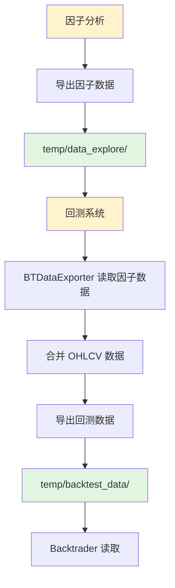

# 统一回测数据导出路径到 temp 目录

## 问题背景

当前系统在运行过程中会创建 `bt/` 和 `bt_data/` 两个文件夹，导致文件管理混乱。需要将所有回测相关的数据统一移动到 `temp` 目录中。

## 当前路径结构

```
项目根目录/
├── temp/
│   └── data_explore/          # 因子数据（按天存储）
├── bt/
│   └── data_export/            # 回测数据（按股票存储）❌ 需要移除
└── bt_data/                    # 测试文件创建 ❌ 需要移除
```

## 目标路径结构

```
项目根目录/
└── temp/
    ├── data_explore/          # 因子数据（按天存储）
    └── backtest_data/         # 回测数据（按股票存储）✅ 新位置
```

## 改动计划

### 1. 核心文件修改

#### 1.1 BTDataExporter 默认路径
**文件**: `backtest/data/exporter.py:32`

**修改前**:
```python
def __init__(self, data_manager, output_dir='./bt/data_export/', factor_data_dir='temp/data_explore/'):
```

**修改后**:
```python
def __init__(self, data_manager, output_dir='temp/backtest_data/', factor_data_dir='temp/data_explore/'):
```

---

#### 1.2 回测脚本配置
**文件**: `scripts/run_backtest.py:39-40`

**修改前**:
```python
DEFAULT_CONFIG = {
    'db_path': './database/quant_data.db',
    'output_dir': 'output/bt_reports',
    'bt_data_dir': './bt/data_export',  # 与 BTDataExporter 默认导出路径一致
}
```

**修改后**:
```python
DEFAULT_CONFIG = {
    'db_path': './database/quant_data.db',
    'output_dir': 'output/bt_reports',
    'bt_data_dir': 'temp/backtest_data',  # 统一到 temp 目录
}
```

---

#### 1.3 配置文件增强
**文件**: `configs/backtest/config.yaml`

**添加配置项** (在 output 部分):
```yaml
# ============================================================================
# 输出配置
# ============================================================================

output:
  dir: "output/bt_reports"
  bt_data_dir: "temp/backtest_data"  # 回测数据导出目录
  save_trades: true
  save_portfolio: true
  generate_report: true
```

**修改 scripts/run_backtest.py** 以支持从配置读取:
```python
BT_DATA_DIR = backtest_config.output.get('bt_data_dir', DEFAULT_CONFIG['bt_data_dir'])
```

---

### 2. 测试文件修改

#### 2.1 test/test_data_bridge.py:32
```python
# 修改前
export_dir = './test/bt_data_export_test/'

# 修改后
export_dir = 'temp/test_bt_data/'
```

#### 2.2 test/test_bt_data_export.py:220
```python
# 修改前
output_dir='./test/bt_data_export_test/'

# 修改后
output_dir='temp/test_bt_data/'
```

#### 2.3 test/test_backtrader_integration_mvp.py:58,297
```python
# 修改前
test_data_dir = './bt/data_export/'

# 修改后
test_data_dir = 'temp/backtest_data/'
```

---

### 3. .gitignore 更新

**文件**: `.gitignore:286-289`

当前已经有了正确的配置，无需修改：
```gitignore
temp/
tmp/
bt_data/
bt/
```

这些目录已经被忽略，所以修改后不会影响 git 版本控制。

---

## 文件清单

### 需要修改的文件

| 文件 | 行号 | 修改内容 |
|------|------|----------|
| `backtest/data/exporter.py` | 32 | 修改默认 output_dir 参数 |
| `scripts/run_backtest.py` | 39, 80 | 修改 DEFAULT_CONFIG 和读取逻辑 |
| `configs/backtest/config.yaml` | 52+ | 添加 bt_data_dir 配置项 |
| `test/test_data_bridge.py` | 32 | 修改测试导出目录 |
| `test/test_bt_data_export.py` | 220 | 修改测试导出目录 |
| `test/test_backtrader_integration_mvp.py` | 58, 297 | 修改测试数据目录 |

### 不需要修改的文件

- `.gitignore` - 已经包含正确的忽略规则
- 其他测试文件使用 `tempfile.mkdtemp()` 创建临时目录，不受影响

---

## 修改影响分析

### 优点
1. **统一管理**: 所有临时数据都在 `temp/` 目录下
2. **便于清理**: 只需清空 `temp/` 目录即可清理所有临时文件
3. **目录结构清晰**: 
   - `temp/data_explore/` - 因子数据
   - `temp/backtest_data/` - 回测数据
4. **避免混淆**: 不再创建 `bt/` 和 `bt_data/` 目录

### 兼容性
- ✅ 不影响现有的因子分析流程
- ✅ 不影响配置文件读取逻辑
- ✅ `.gitignore` 已经包含 `temp/` 忽略规则
- ✅ 所有相对路径保持一致性

### 注意事项
1. 如果用户手动指定了 `output_dir` 参数，会优先使用用户指定的路径
2. 配置文件中的 `bt_data_dir` 优先级高于代码默认值
3. 测试文件中的路径修改不影响测试逻辑，只是改变了存储位置

---

## 实施步骤

1. ✅ 分析现有代码和配置
2. 修改核心代码文件
   - `backtest/data/exporter.py`
   - `scripts/run_backtest.py`
   - `configs/backtest/config.yaml`
3. 修改测试文件
   - `test/test_data_bridge.py`
   - `test/test_bt_data_export.py`
   - `test/test_backtrader_integration_mvp.py`
4. 验证修改
   - 运行因子分析，检查数据导出路径
   - 运行回测，检查数据读取路径
   - 运行相关测试，确保测试通过

---

## 数据流程图



---

## 验证清单

- [ ] `temp/data_explore/` 正常存储因子数据
- [ ] `temp/backtest_data/` 正常存储回测数据
- [ ] `bt/` 和 `bt_data/` 不再被创建
- [ ] 回测流程正常运行
- [ ] 相关测试通过

---

## 回滚方案

如果修改后出现问题，可以通过以下步骤回滚：

1. 恢复 `backtest/data/exporter.py:32`
   ```python
   output_dir='./bt/data_export/'
   ```

2. 恢复 `scripts/run_backtest.py:39`
   ```python
   'bt_data_dir': './bt/data_export'
   ```

3. 移除 `configs/backtest/config.yaml` 中的 `bt_data_dir` 配置项

4. 恢复测试文件中的路径
